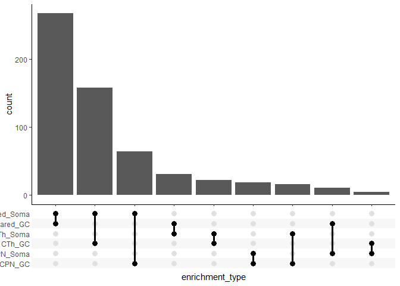
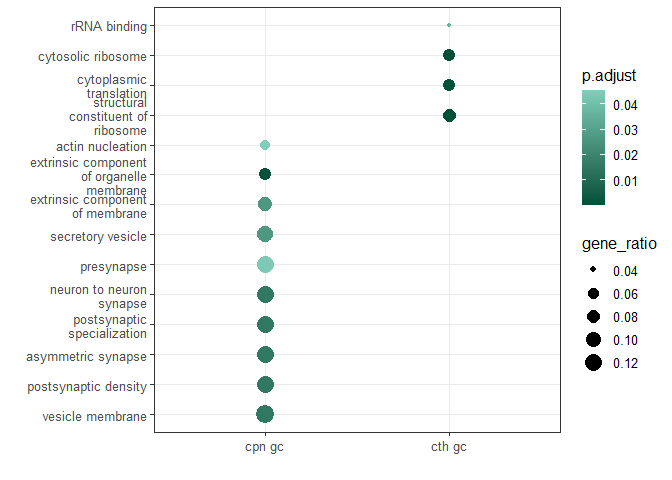
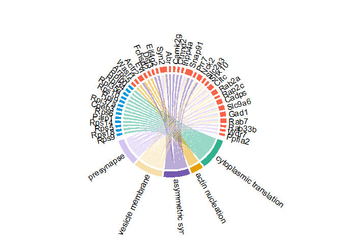

Figure2_Analysis
================
Priya Veeraraghavan
2023-03-26

``` r
library(circlize)
```

    ## Warning: package 'circlize' was built under R version 4.2.3

``` r
library(rjson)

input <- "C:/Users/prv892/Documents/GitHub/amalgam/metadata.json"

file_path_ref <- fromJSON(file = input)

# import the relevant parameters and references
source(file.path(file_path_ref$project_directory, 
                 file_path_ref$sequencing$setup_script))
```

    ## Warning: package 'dplyr' was built under R version 4.2.3

``` r
source(file.path(file_path_ref$project_directory,
                 file_path_ref$plots$setup_script))
```

# Main figure

``` r
# volcano GC subtypes
plot_main_2a <- function(plot_savefile) {
  
  load( file.path(file_path_ref$project_directory,
                          file_path_ref$sequencing$results$dpc23_gcs_comparison))
  
  # dge data in res_gc
  # subset to retain genes that 
  # (1) are same between GCFs and above background in either
  # (2) are cpn-GC enriched and above background in CPN GCs but also enriched in thalamus gcf
  # (3) are cth-GC enriched and above background in CThPN GCs but also enriched in forebrain gcf
  res_gc_toplot <- res_gc %>% 
    subset((is_gcf_constant & (is_cpn_over_input | is_cth_over_input)) |
             (is_cpn_subtype_gc & is_cpn_over_input & is_thalamus_gcf) |
             (is_cth_subtype_gc & is_cth_over_input & is_forebrain_gcf))
  
  res_gc_tolabel <- subset(res_gc_toplot, padj < 1e-6)
  
  plt <- rasterize(ggplot(res_gc_toplot, 
         aes(log2FoldChange, -log10(padj))) +
    geom_point(color=background_color, 
               size=0.5) +
      theme_classic(), dpi=300) +
    rasterize(geom_point(data=subset(res_gc_toplot, is_cpn_subtype_gc),
               mapping=aes(log2FoldChange, -log10(padj)),
               color=cpn_color,
               size=0.5), dpi=300) +
    rasterize(geom_point(data=subset(res_gc_toplot, is_cth_subtype_gc),
               mapping=aes(log2FoldChange, -log10(padj)),
               color=cthpn_color,
               size=0.5), dpi=300) +
    xlab("Log2 Fold Change CTh GC DPC23/CPN GC DPC23") +
    geom_hline(yintercept=-log10(0.05), color=background_color_dark, linetype="dashed") +
    geom_text_repel(data=res_gc_tolabel,
                    mapping=aes(log2FoldChange, -log10(padj), label=external_gene_name),
                    size=1, max.overlaps=30, min.segment.length = 0, segment.color=background_color_dark, segment.size=0.1) +
    theme(text=element_text(size=7))
    
  
  plot(plt)
  
   ggsave( plot_savefile,
         plot=plt, device="pdf",
         width=52, height=48, units="mm", useDingbats=FALSE)

}

plot_main_2a(file.path(file_path_ref$project_directory,
                       file_path_ref$plots$plot_directory, "main_2a.pdf"))
```

<!-- -->

``` r
# quadrant plot subtypes
plot_main_2b <- function(plot_savefile) {
  
    
  # gc dge data in res_gc
  # subset to retain genes that 
  # (1) are same between GCFs and above background in either
  # (2) are cpn-GC enriched and above background in CPN GCs but also enriched in thalamus gcf
  # (3) are cth-GC enriched and above background in CThPN GCs but also enriched in forebrain gcf
  load( file.path(file_path_ref$project_directory,
                          file_path_ref$sequencing$results$dpc23_gcs_comparison))
 
  res_gc_toplot <- res_gc %>% 
    subset((is_gcf_constant & (is_cpn_over_input | is_cth_over_input)) |
             (is_cpn_subtype_gc & is_cpn_over_input & is_thalamus_gcf) |
             (is_cth_subtype_gc & is_cth_over_input & is_forebrain_gcf)) %>%
    rowwise() %>%
    mutate(gc_subtype=ifelse(is_cpn_subtype_gc, "CPN", 
                             ifelse(is_cth_subtype_gc, "CTh", "Shared")))
  
  # soma dge data in dge_res
  load(file.path(file_path_ref$project_directory, 
                             file_path_ref$sequencing$results$dpc23_soma_comparison))
  
  res_soma_toplot <- dge_res %>% rowwise() %>%
    mutate(soma_subtype=ifelse(CPN_Enriched, "CPN",
                               ifelse(CThPN_Enriched, "CTh", "Shared")))
  
  # combine the two dge results
  res_toplot <- res_gc_toplot %>% inner_join(res_soma_toplot, 
                                             by=c("ensembl_gene_id", 
                                                  "external_gene_name"),
                                             suffix=c(".gc", ".soma"))
  
  
  plt <- rasterize(ggplot(res_toplot, aes(log2FoldChange.soma, 
                                          log2FoldChange.gc, 
                                          color=gc_subtype, 
                                          shape=soma_subtype)) + 
                     geom_point(size=0.5) + 
                     scale_color_manual(values=c(cpn_color, cthpn_color, background_color)) +
                     theme_classic() +
                     theme(legend.position="None",
                           text=element_text(size=7)), dpi=300) 
  
  plot(plt)
  
  ggsave( plot_savefile,
         plot=plt, device="pdf",
         width=52, height=52, units="mm", useDingbats=FALSE)

    

  
}

plot_main_2b(file.path(file_path_ref$project_directory,
                       file_path_ref$plots$plot_directory, "main_2b.pdf"))
```

<!-- -->

``` r
# upset plot
plot_main_2c <- function(plot_savefile) {
  
  # gc dge data in res_gc
  # subset to retain genes that 
  # (1) are same between GCFs and above background in either
  # (2) are cpn-GC enriched and above background in CPN GCs but also enriched in thalamus gcf
  # (3) are cth-GC enriched and above background in CThPN GCs but also enriched in forebrain gcf
  load( file.path(file_path_ref$project_directory,
                          file_path_ref$sequencing$results$dpc23_gcs_comparison))
 
  res_gc_toplot <- res_gc %>% 
    subset((is_gcf_constant & (is_cpn_over_input | is_cth_over_input)) |
             (is_cpn_subtype_gc & is_cpn_over_input & is_thalamus_gcf) |
             (is_cth_subtype_gc & is_cth_over_input & is_forebrain_gcf)) %>%
    rowwise() %>%
    mutate(gc_subtype=ifelse(is_cpn_subtype_gc, "CPN_GC", 
                             ifelse(is_cth_subtype_gc, "CTh_GC", "Shared_GC")))
  

  # soma dge data in dge_res
  load(file.path(file_path_ref$project_directory, 
                             file_path_ref$sequencing$results$dpc23_soma_comparison))
  
  res_soma_toplot <- dge_res %>% rowwise() %>%
    mutate(soma_subtype=ifelse(CPN_Enriched, "CPN_Soma",
                               ifelse(CThPN_Enriched, "CTh_Soma", "Shared_Soma")))
  
  # combine the two dge results
  res_toplot <- res_gc_toplot %>% inner_join(res_soma_toplot, 
                                             by=c("ensembl_gene_id", 
                                                  "external_gene_name"),
                                             suffix=c(".gc", ".soma"))
  
  plt <- res_toplot %>% 
         rowwise() %>%
         mutate(enrichment_type=list(c(gc_subtype, soma_subtype))) %>%
    ggplot(aes(enrichment_type)) + 
      geom_bar() + 
      scale_x_upset(intersections=list(c("Shared_Soma", "Shared_GC"),
                                       c("Shared_Soma", "CTh_GC"),
                                       c("Shared_Soma", "CPN_GC"),
                                       c("CTh_Soma", "Shared_GC"),
                                       c("CPN_Soma", "Shared_GC"),
                                       c("CTh_Soma", "CTh_GC"),
                                       c("CPN_Soma", "CPN_GC"),
                                       c("CTh_Soma", "CPN_GC"),
                                       c("CPN_Soma", "CTh_GC")),
                    sets=c("Shared_Soma", "Shared_GC", 
                           "CTh_Soma", "CTh_GC", 
                           "CPN_Soma", "CPN_GC")) + 
      theme_classic()
  
  plot(plt)
  
   ggsave( plot_savefile,
         plot=plt, device="pdf",
         width=63*2, height=47*2, units="mm", useDingbats=FALSE)

  
  
}

plot_main_2c(file.path(file_path_ref$project_directory,
                       file_path_ref$plots$plot_directory, "main_2c.pdf"))
```

<!-- -->

``` r
# boxplots example genes (???)
plot_main_2d <- function(plot_savefile) {
  
}
```

``` r
# disease gene forest plot
plot_main_2e <- function(plot_savefile) {
  
  load(file.path(file_path_ref$project_directory, file_path_ref$sequencing$results$intersect_disease_genes))
  
  plt <- ggplot(fishers_res, aes(odds_ratio, disease_group, xmin=CI_low, xmax=CI_high, color=express_group)) + 
    geom_point(position=position_dodge(0.5), size=1) +
    geom_errorbar(position=position_dodge(0.5), width=0.2, linewidth=0.5) +
    scale_x_log10(limits=c(NA, 30)) + 
    scale_color_manual(values=c(colorRampPalette(c("white", cpn_color, "black"))(10)[c(3,7)],
                                colorRampPalette(c("white", cthpn_color, "black"))(10)[c(3, 7)])) +
    theme_classic() +
    geom_vline(xintercept=1, linetype='dashed', color=background_color_dark) +
    ylab("") +
    xlab("Odds Ratio") +
  theme(legend.position="none", text=element_text(size=7))

 plot(plt)
 
 ggsave( plot_savefile,
         plot=plt, device="pdf",
         width=32*2, height=51*2, units="mm", useDingbats=FALSE)
  
  
}
plot_main_2e(file.path(file_path_ref$project_directory,
                       file_path_ref$plots$plot_directory, "main_2e.pdf"))
```

<!-- -->

``` r
# go terms gc subtype

plot_main_2f <- function(plot_savefile) {
  
  # glm based
  load(file.path(file_path_ref$project_directory,
               file_path_ref$sequencing$results$dpc23_gcs_comparison))
  
  plt <- plot_goterm_dotplot(simplify(subtype_enrichment)@compareClusterResult, count_thresh=5) +
    theme(text=element_text(size=12)) 
  
  plot(plt)
  ggsave( plot_savefile,
         plot=plt, device="pdf",
         width=28*6, height=63*6, units="mm", useDingbats=FALSE)

  
  
}

plot_main_2f(file.path(file_path_ref$project_directory,
                       file_path_ref$plots$plot_directory, "main_2f.pdf"))
```

<!-- -->

``` r
# chord plot
plot_main_2g <- function(plot_savefile) {
  
  # load the goterms 
   load(file.path(file_path_ref$project_directory,
               file_path_ref$sequencing$results$dpc23_gcs_comparison))
  
  terms_to_display <- c("cytoplasmic translation", "actin nucleation", 
                        "asymmetric synapse", "presynapse", "vesicle membrane")
 
  adjacency <- data.frame(subtype_enrichment@compareClusterResult %>%
    subset(Description %in% terms_to_display) %>%
    separate_rows(geneID, sep="/") %>%
    dplyr::select(Description, geneID, Cluster))
  
  colnames(adjacency) <- c("from", "to", "sample_type")

accent_color_dark_lst <- colorRampPalette(c("white", accent_color_dark, "black"))(6)

accent_color_mid_lst <- colorRampPalette(c("white", "mediumpurple", "black"))(6)

accent_color_light_lst <- colorRampPalette(c("white", accent_color_light, "black"))(7)
  
grid.col = c(accent_color_dark_lst[3], accent_color_light_lst[4], accent_color_mid_lst[4], accent_color_mid_lst[2], accent_color_light_lst[2], 
             sapply(adjacency$sample_type, function(s) ifelse(s=="cpn_gc", cpn_color, ifelse(s=="cth_gc", cthpn_color, background_color_dark))))

names(grid.col) <- c(terms_to_display,
                     adjacency$to)
 
pdf(plot_savefile, height=5.3, width=5.9) 
chordDiagram(adjacency, big.gap=5, small.gap=2,  grid.col=grid.col, link.sort=FALSE, annotationTrack = "grid", 
             preAllocateTracks = list(track.height = max(strwidth(unlist(dimnames(adjacency))))))

# we go back to the first track and customize sector labels
circos.track(track.index = 1, panel.fun = function(x, y) {
  circos.text(CELL_META$xcenter, CELL_META$ylim[1], CELL_META$sector.index, 
              facing = "clockwise", niceFacing = TRUE, adj = c(0, 0.5))
}, bg.border = NA) # here set bg.border to NA is important
dev.off()

chordDiagram(adjacency, big.gap=5, small.gap=2,  grid.col=grid.col, link.sort=FALSE, annotationTrack = "grid", 
             preAllocateTracks = list(track.height = max(strwidth(unlist(dimnames(adjacency))))))

# we go back to the first track and customize sector labels
circos.track(track.index = 1, panel.fun = function(x, y) {
  circos.text(CELL_META$xcenter, CELL_META$ylim[1], CELL_META$sector.index, 
              facing = "clockwise", niceFacing = TRUE, adj = c(0, 0.5))
}, bg.border = NA) # here set bg.border to NA is important

}

plot_main_2g(file.path(file_path_ref$project_directory,
                       file_path_ref$plots$plot_directory,
                       "main_2g.pdf"))
```

<!-- -->
